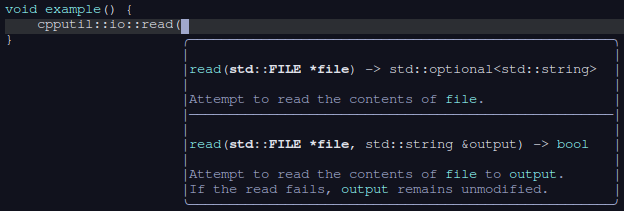
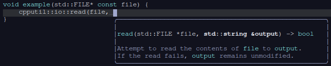
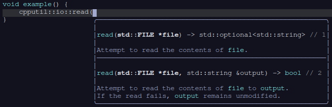
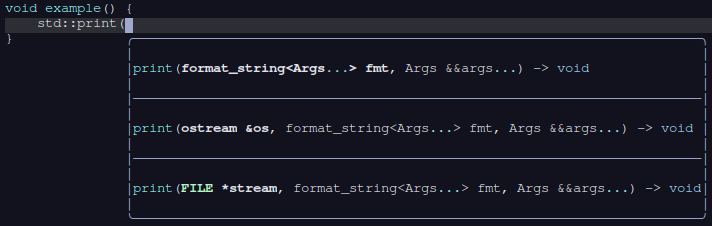

# nvim-everysig

A tiny neovim plugin that provides an alternate [`textDocument/signatureHelp`](https://microsoft.github.io/language-server-protocol/specifications/lsp/3.17/specification/#textDocument_signatureHelp) request handler that displays every signature returned by the language server.

## Screenshots

Every signature visible:



Only viable signature visible:



Numbered signatures:



C++23 `std::print`:



### Regarding empty lines

With `nvim 0.10`, each signature is surrounded by empty lines. This should be fixed when [vertical conceal](https://github.com/neovim/neovim/issues/25718) is implemented.

## Optional setup

```lua
require('everysig').setup(options)
```

The `options` table may contain the following keys:

- override: boolean (default false), whether to override the default signature help handler.
- number: boolean (default false), whether to append number comments to displayed signatures.

Example plugin spec for [lazy.nvim](https://github.com/folke/lazy.nvim):

```lua
{
    'aattoa/nvim-everysig',
    opts = { override = true },
    lazy = true,         -- Lazy-load the plugin ...
    event = 'LspAttach', -- ... when an LSP client attaches to a buffer.
}
```

If overridden, the signature help request is triggered with the usual `vim.lsp.buf.signature_help`. For example, to get signature help with ctrl+space in normal mode and insert mode:

```lua
vim.keymap.set({ 'n', 'i' }, '<C-Space>', vim.lsp.buf.signature_help)
```

## The handler

The signature help handler can be accessed without any setup.

For example, manually override the default handler (same as `setup({ override = true })`):

```lua
vim.lsp.handlers['textDocument/signatureHelp'] = require('everysig').signature_help_handler
```
